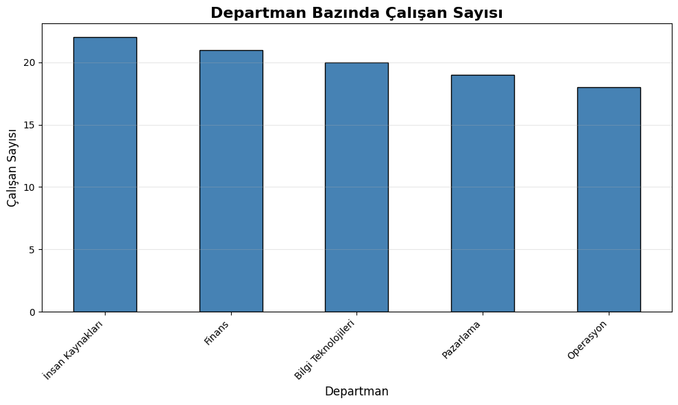
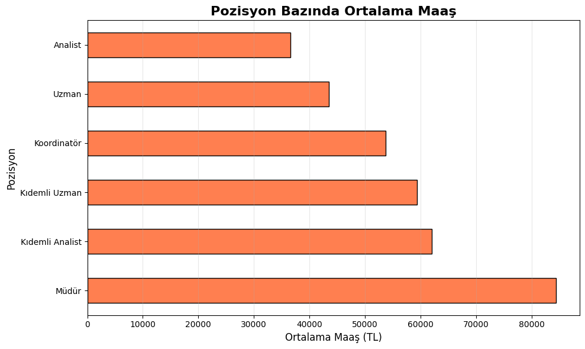
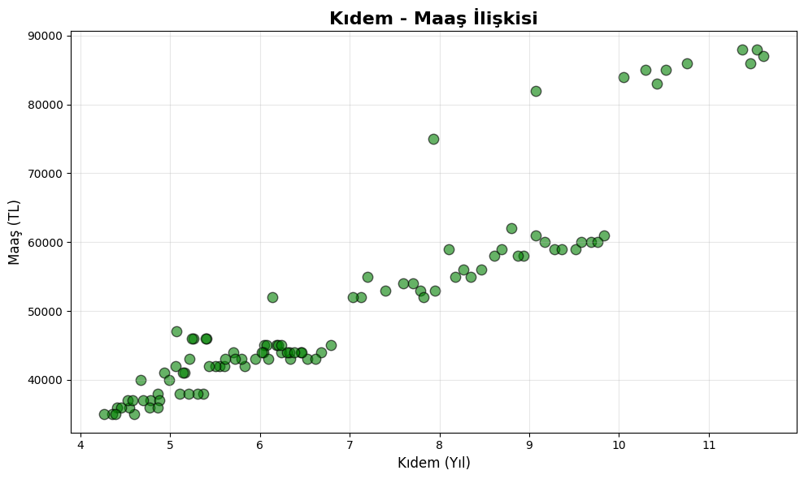
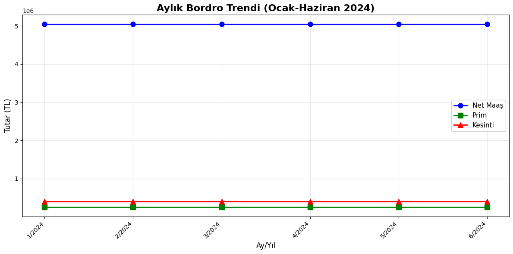
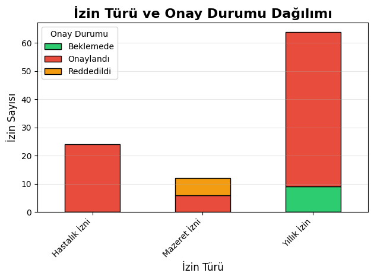
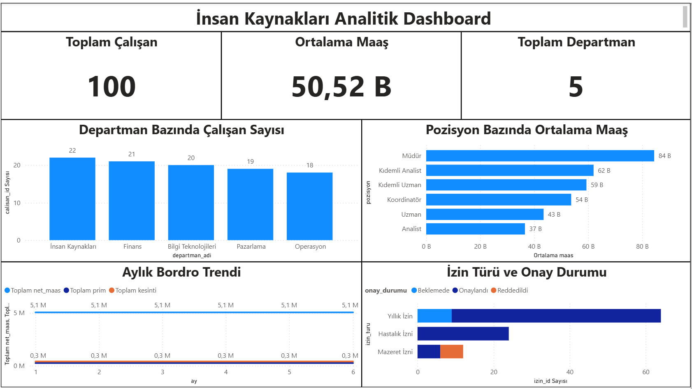
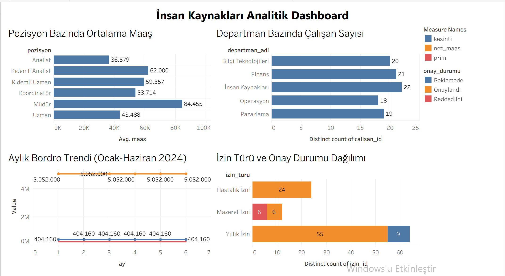

# 📊 İnsan Kaynakları Analitik Projesi

SQL, Python, Power BI ve Tableau kullanarak gerçekleştirilen uçtan uca İK analitiği çalışması. 100 çalışan ve 5 departman verisi üzerinden detaylı analizler ve interaktif görselleştirmeler.

---

## 🎯 Proje Hedefi

Bu proje, bir şirketin İnsan Kaynakları verilerini kapsamlı bir şekilde analiz ederek şu temel soruları yanıtlamaktadır:

- 📌 Departmanlar arası çalışan dağılımı nasıl bir yapı sergiliyor?
- 💰 Pozisyonlara göre ücretlendirme ne durumda?
- 📈 Aylık bordro maliyetleri hangi trendi takip ediyor?
- 🏖️ İzin kullanım oranları ve onay süreçleri nasıl işliyor?

---

## 📁 Veri Yapısı

Proje, ilişkisel veritabanı modeli üzerine inşa edilmiş 4 ana tabloya dayanmaktadır:

| Tablo | Kayıt Sayısı | İçerik |
|-------|--------------|--------|
| **Calisanlar** | 100 | Ad, soyad, departman, pozisyon, maaş, işe giriş tarihi |
| **Departmanlar** | 5 | Departman adı, yönetici, lokasyon, bütçe bilgileri |
| **Bordro** | 600 | 6 aylık bordro verileri (Ocak-Haziran 2024): Net maaş, prim, kesinti |
| **Izinler** | 100 | İzin türü, başlangıç-bitiş tarihleri, onay durumları |

**Veri Setine Erişim:** [`Data/`](Data/) klasöründe CSV ve Excel formatlarında

---

## 🛠️ Teknoloji Stack'i

- **PostgreSQL:** Veritabanı tasarımı, tablo ilişkileri ve analitik sorgular
- **Python:** Pandas, Matplotlib, Seaborn ile veri analizi ve görselleştirme
- **Power BI:** İnteraktif dashboard ve KPI kartları
- **Tableau Public:** Web tabanlı görselleştirme ve paylaşım

---

## 📂 Dosya Yapısı
```
IK-Analitigi-Projesi/
│
├── Data/                         # Kaynak veri dosyaları
│   ├── Calisanlar.csv
│   ├── Departmanlar.csv
│   ├── Bordro.csv
│   ├── Izinler.csv
│   └── IK_Veri_Seti.xlsx        # Tüm tablolar tek dosyada
│
├── SQL/                          # Veritabanı ve analiz scriptleri
│   └── IK_Analizleri.sql        # Tablo oluşturma + 8 analiz sorgusu
│
├── Python/                       # Python analizi ve grafikler
│   ├── IK_Analizi_Python.ipynb  # Jupyter Notebook
│   ├── departman_dagilimi.png
│   ├── pozisyon_maas.png
│   ├── kidem_maas.png
│   ├── aylik_bordro_trend.png
│   └── izin_analizi.png
│
├── PowerBI/                      # Power BI çalışmaları
│   ├── IK_Dashboard.pbix        # Dashboard dosyası
│   └── Dashboard_Genel.png      # Dashboard görseli
│
└── Tableau/                      # Tableau çalışmaları
    ├── IK_Analitigi_Dashboard.twbx  # Tableau Packaged Workbook
    └── Tableau_Dashboard.png        # Dashboard görseli
```

---

## 📊 Gerçekleştirilen Analizler

### 🔷 SQL Analizleri

[`SQL/IK_Analizleri.sql`](SQL/IK_Analizleri.sql) dosyasında 8 farklı analiz sorgusu bulunmaktadır:

1. **Departman Bazında Çalışan Sayısı** - Headcount analizi ve yüzdesel dağılım
2. **Pozisyon Bazında Maaş İstatistikleri** - Ortalama, minimum, maksimum maaşlar
3. **Departman Bazında Maaş Maliyeti** - Toplam ve ortalama maaş hesaplamaları
4. **Kıdem Analizi** - En uzun süredir çalışan personel listesi
5. **Aylık Bordro Toplamı** - 6 aylık trend analizi
6. **İzin Kullanım Analizi** - İzin türleri ve onay oranları
7. **En Yüksek Ücretli Çalışanlar** - Top 10 listesi
8. **Departman Bazında İzin Kullanımı** - Departmanlar arası karşılaştırma

### 🔷 Python Görselleştirmeleri

[`Python/IK_Analizi_Python.ipynb`](Python/IK_Analizi_Python.ipynb) notebook'unda 5 görselleştirme:

| Görsel | Analiz | Dosya |
|--------|--------|-------|
|  | **Departman Dağılımı** - Çalışan sayıları | [departman_dagilimi.png](Python/departman_dagilimi.png) |
|  | **Pozisyon-Maaş** - Ortalama ücret karşılaştırması | [pozisyon_maas.png](Python/pozisyon_maas.png) |
|  | **Kıdem-Maaş İlişkisi** - Scatter plot analizi | [kidem_maas.png](Python/kidem_maas.png) |
|  | **Aylık Bordro Trendi** - 6 aylık maliyet analizi | [aylik_bordro_trend.png](Python/aylik_bordro_trend.png) |
|  | **İzin Analizi** - Tür ve onay durumları | [izin_analizi.png](Python/izin_analizi.png) |

### 🔷 Power BI Dashboard



**Dashboard Bileşenleri:**
- 📌 KPI Kartları: Toplam Çalışan (100), Ortalama Maaş (50.52B TL), Departman Sayısı (5)
- 📊 Departman bazında çalışan sayısı (sütun grafiği)
- 📊 Pozisyon bazında ortalama maaş (yatay çubuk grafiği)
- 📈 Aylık bordro trendi - Net maaş, prim, kesinti (çizgi grafiği)
- 📊 İzin türü ve onay durumu dağılımı (yığılmış çubuk grafiği)

**Dosya:** [`PowerBI/IK_Dashboard.pbix`](PowerBI/IK_Dashboard.pbix)

### 🔷 Tableau Dashboard



**İnteraktif dashboard Tableau Public'te canlı olarak görüntülenebilir:**

🔗 **[Tableau Dashboard - Canlı Erişim](https://public.tableau.com/app/profile/onur.ayd.nda./viz/IK_Analitigi_Dashboard/IKDashboard)**

**Dashboard Özellikleri:**
- Filtreleme ve detaya inme imkanı
- Pozisyon ve departman bazında dinamik görselleştirmeler
- 6 aylık bordro trend analizi
- İzin yönetimi metrikleri

**Dosyalar:** 
- [`Tableau/IK_Analitigi_Dashboard.twbx`](Tableau/IK_Analitigi_Dashboard.twbx) - Tableau Packaged Workbook (indirilebilir)
- [`Tableau/Tableau_Dashboard.png`](Tableau/Tableau_Dashboard.png) - Dashboard görseli

---

## 💡 Temel Bulgular

Analizler sonucunda elde edilen önemli içgörüler:

| Metrik | Sonuç |
|--------|-------|
| 👥 **En Büyük Departman** | İnsan Kaynakları (22 çalışan - %22) |
| 💼 **En Yüksek Ortalama Maaş** | Müdür pozisyonu (84.455 TL) |
| 💰 **Aylık Bordro Maliyeti** | ~5.05M TL (6 ay boyunca sabit) |
| 🏖️ **En Çok Kullanılan İzin** | Yıllık İzin (64 kayıt) |
| ✅ **İzin Onay Oranı** | %86 Onaylandı, %14 Beklemede |
| 📊 **Prim Oranı** | Maaşın %5'i |
| 📉 **Kesinti Oranı** | Maaşın %8'i |

---

## 🎓 Proje Yaklaşımı

Bu proje, **end-to-end data analytics** workflow'unu göstermektedir:

1. **Veri Modelleme** - İlişkisel veritabanı tasarımı (Foreign Key ilişkileri)
2. **Veri Hazırlama** - CSV formatında temiz veri setleri oluşturma
3. **SQL Analizi** - PostgreSQL üzerinde 8 farklı analitik sorgu
4. **Python EDA** - Pandas ile veri analizi ve Matplotlib/Seaborn ile görselleştirme
5. **BI Dashboard** - Power BI ve Tableau ile interaktif görselleştirme
6. **Paylaşım** - GitHub ve Tableau Public üzerinden proje dökümantasyonu

---

## ⚠️ Önemli Not

**Bu projede kullanılan tüm veriler tamamen rastgele üretilmiştir.** Çalışan isimleri, departman bilgileri, maaş tutarları ve diğer tüm bilgiler gerçek kişi, kurum veya kuruluşlarla ilişkili değildir.

---

## 📧 İletişim

**Onur Aydındağ**

- 📊 **Tableau Public:** [public.tableau.com/profile/onur.ayd.nda.](https://public.tableau.com/app/profile/onur.ayd.nda.)
- 💼 **LinkedIn:** [linkedin.com/in/onur-aydındağ-aa528a216](https://www.linkedin.com/in/onur-aydındağ-aa528a216)
